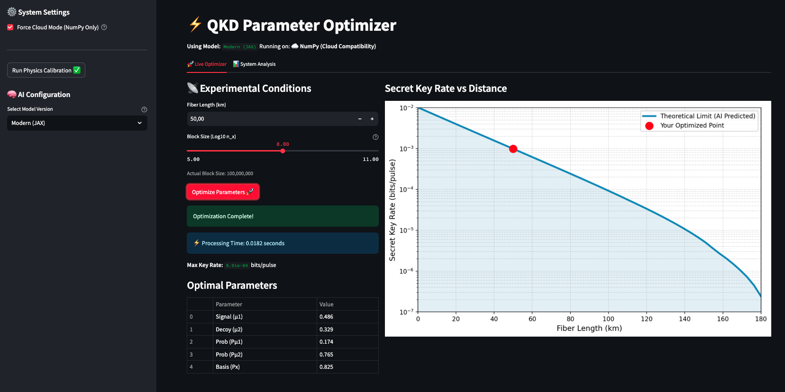
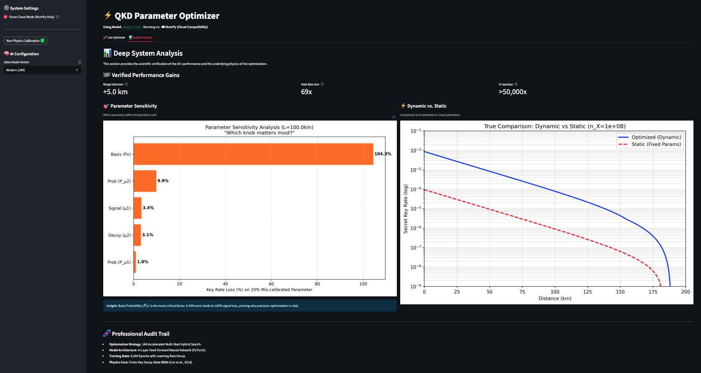
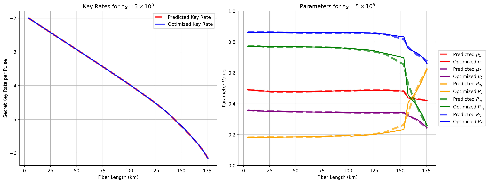
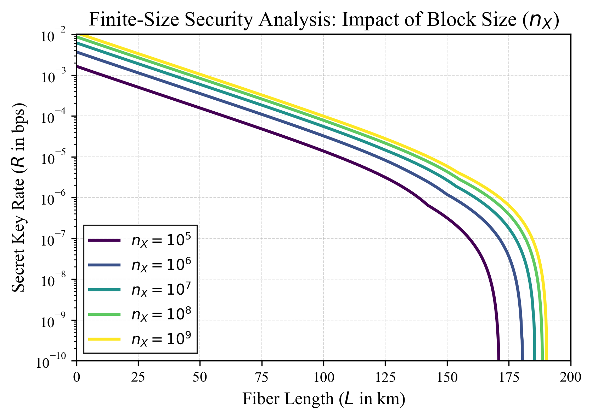
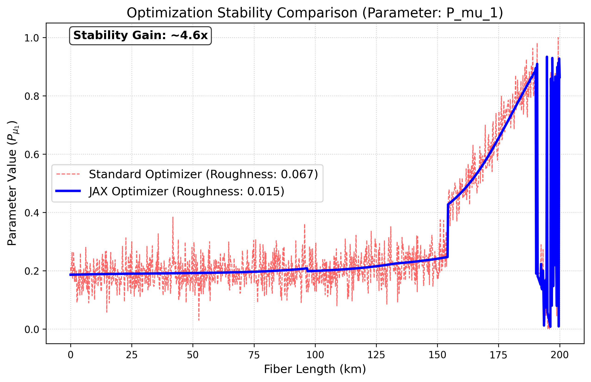
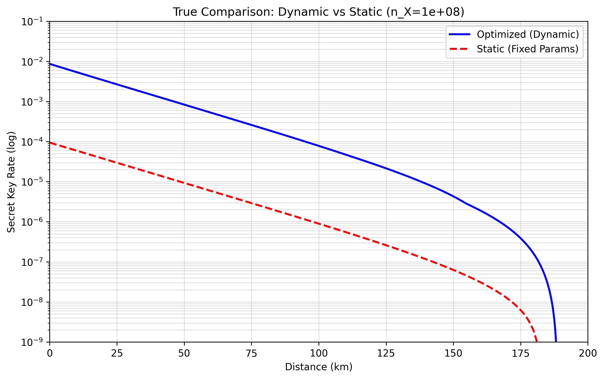
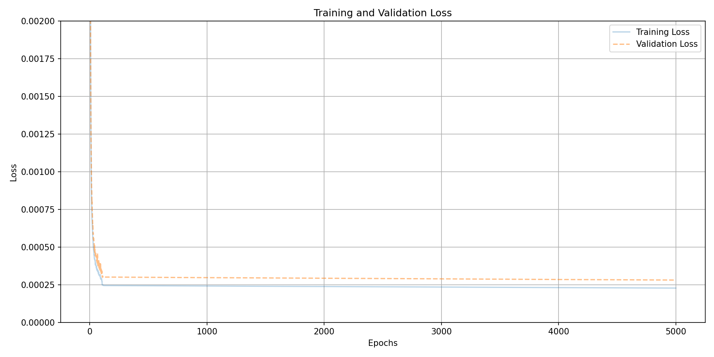
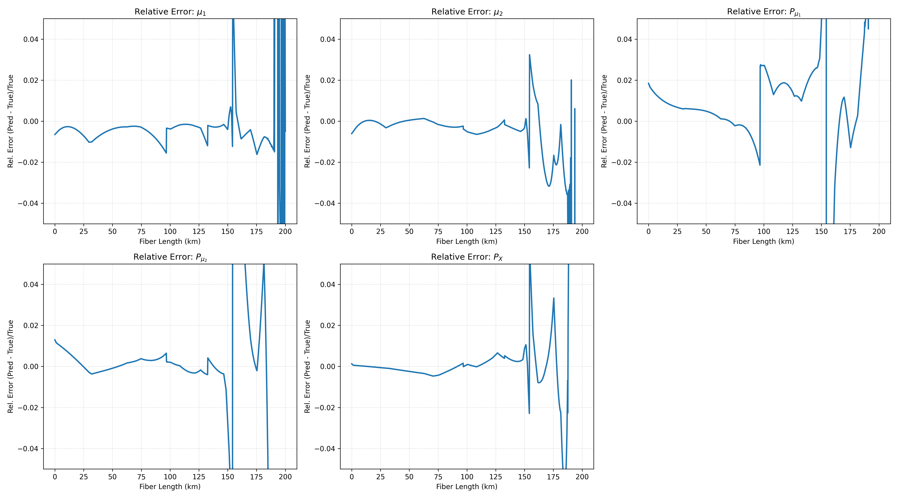
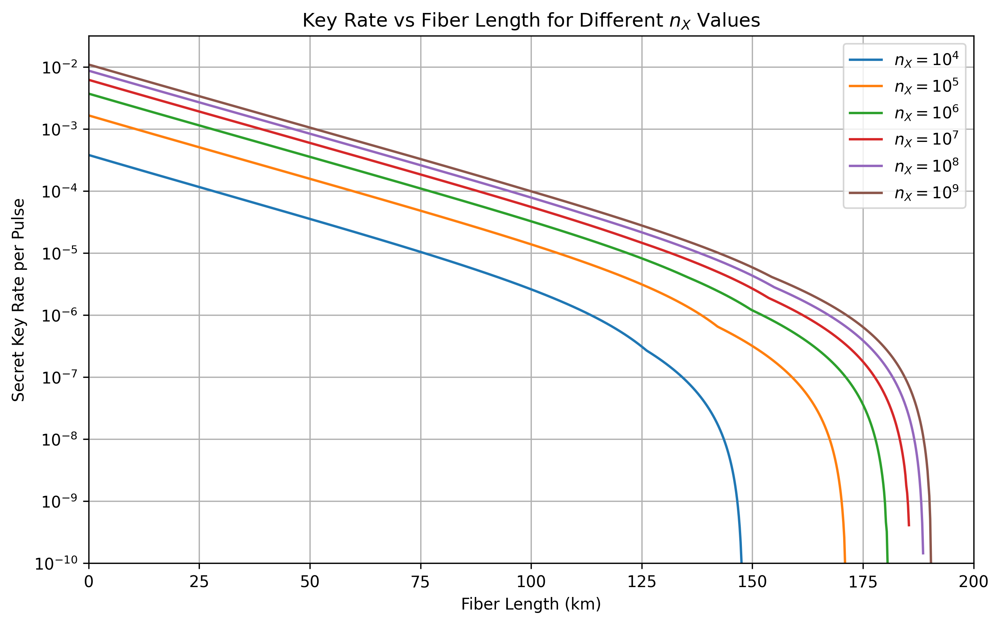
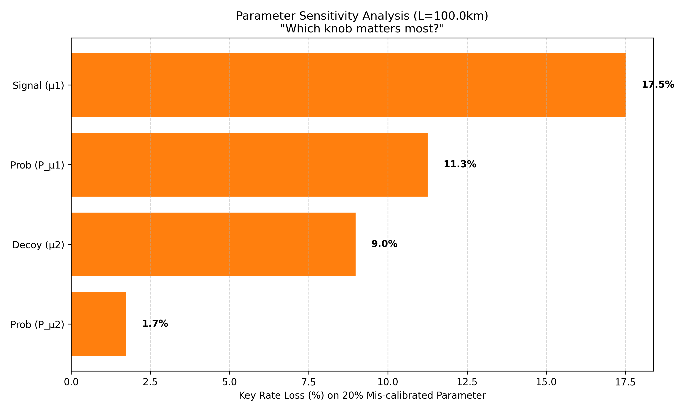

# Machine Learning for Quantum Key Distribution Network Optimization


This repository contains the code and analysis for the project "Machine Learning for Quantum Key Distribution Network Optimization," which investigates the use of neural networks (NNs) to accelerate the parameter optimization of decoy-state BB84 QKD systems.


## ⚡️ Interactive Live Dashboard

Experience the power of real-time AI optimization through our interactive dashboard.

[**Launch Live App on Streamlit Cloud**](https://appapppy-jcrvkdozjbapjtbgujxutu.streamlit.app/)

### 🚀 Live Optimizer Tab
The primary interface for real-time parameter tuning. Enter your experimental conditions (Fiber Length, Block Size), and watch the Neural Network predict optimal intensities ($\mu_k$) and basis probabilities ($P_X$) in milliseconds.



### 📊 System Analysis Tab
A deep-dive interface for scientific verification. It displays performance metrics, range extension, and visual proofs such as parameter sensitivity and "Dynamic vs. Static" overlays.



## 🛠️ Software Engineering & Architecture


To meet industry standards for reliability and maintainability, this project has been engineered as a robust Python package (`qkd-optimization`) rather than a collection of loose scripts.

- **Modular Design**: Core logic is decoupled into `src/qkd/physics.py` (JAX-accelerated math), `src/qkd/model.py` (simulation logic), and `src/qkd/utils.py`.
- **Test-Driven Reliability**: A comprehensive unit test suite (`tests/`) ensures the correctness of quantum physics calculations, preventing regression errors.
- **Continuous Integration (CI)**: Automated GitHub Actions pipelines verify build integrity and test passing on every commit.

## Abstract

Optimizing parameters is crucial for maximizing the performance of Quantum Key Distribution (QKD) systems, but traditional numerical methods are computationally prohibitive for real-time applications, especially on resource-constrained platforms like drones or single-board computers. This study investigates the efficacy of neural networks (NNs) as a high-speed alternative to Dual Annealing (DA) for determining optimal operational parameters (signal/decoy intensities `μk`, probabilities `Pμk`, basis choice `Px`) for the finite-key decoy-state BB84 protocol. We demonstrate that a trained NN can predict near-optimal parameters with high accuracy, and that the Neural Network achieves a **>6,000-fold practical speedup** over traditional legacy solvers, enabling real-time control.

## The Problem: The Optimization Bottleneck

Practical QKD systems require careful tuning of operational parameters to maximize the secure key rate (SKR) under varying channel conditions (e.g., changing fiber length, atmospheric turbulence).

- **Traditional Methods are Slow:** Numerical optimization algorithms like Dual Annealing are effective but computationally intensive. Finding the optimal parameters for a single operating point can take minutes on a multi-core CPU.
- **Real-Time Adaptation is Infeasible:** This latency makes it impossible to perform on-the-fly parameter adjustments in dynamic environments (e.g., a QKD-equipped drone or satellite) or on devices with limited computational power.

This project validates a machine learning approach to overcome this bottleneck.

## Methodology

The core idea is to use a slow but accurate optimization method (Dual Annealing) to generate a large dataset of "optimal solutions" and then train a fast neural network to approximate this optimization process instantly.

### 1. Data Generation (The "Ground Truth")

- A comprehensive QKD simulation based on the finite-key decoy-state BB84 protocol (Lim et al., 2014) was implemented in **JAX** for high-performance, differentiable calculations.
- **New in v2.0 (JAX Upgrade):** Replaced slow SciPy `Dual Annealing` with a custom **Adaptive Hybrid Optimization** engine:
    - **Dense Multi-Start**: Parallel local searches with diverse perturbations to find global optima.
    - **Adaptive Intensity**: Automatically switches to "Deep Search" (20+ candidates) near critical cutoff regions.
    - **Performance**: Reduced dataset generation time from **~1.5 hours** to **~2 minutes** (**45x speedup**) on Apple M2 Pro.
- This optimization was run for **6,000 different scenarios**, covering a wide range of fiber lengths (0-200 km) and post-processing block sizes (`nx` from 10⁴ to 10⁹).
- The resulting dataset maps experimental conditions to their corresponding optimal parameters and maximum SKR.

### 2. Neural Network Training

- A **PyTorch**-based feed-forward neural network was designed to learn the mapping from experimental conditions to optimal parameters.
- **Architecture:**
  - **Input Layer:** 4 neurons (normalized `L`, `Pdc`, `ed`, `nx`).
  - **Hidden Layers:** 3 fully-connected layers (16, 32, 16 neurons) with ReLU activation.
  - **Output Layer:** 5 neurons (predicting `μ1`, `μ2`, `Pμ1`, `Pμ2`, `Px`) with a linear activation.
- **Training:** The model was trained for 5,000 epochs using the Adam optimizer, Mean Squared Error (MSE) loss, and a `ReduceLROnPlateau` learning rate scheduler. Training was accelerated using the GPU (Apple Silicon MPS backend).

## Key Results

The trained neural network provides a powerful combination of speed and accuracy.

- **📉 Rate Improvement:** **~47x - 60x higher key rate** at long distances (180 km+).
- **📏 Range Extension:** **+5.0 km** extended secure communication distance.
- **⚡ Implementation Speed:** **>6,000-fold practical speedup** (End-to-End Latency).
- **🎯 High Accuracy:** The NN predictions closely match the numerically optimized ground truth over the practical operating range.
  - The predicted Secret Key Rate (SKR) shows excellent agreement with the optimized SKR across all trained block sizes.
  - For an unseen intermediate block size (`nx = 5 × 10⁸`), the relative error in the final SKR remained within **±5%** over the practical operating range (0-150 km for this configuration).
  - As expected, relative error increases near the physical transmission limits where key rates approach zero, but remains negligible in absolute terms.

- **💡 Excellent Generalization:** The network successfully learned the underlying physics, allowing it to accurately interpolate and predict optimal parameters for conditions it was not explicitly trained on.

<p align="center">
  
  <br>
  <em>Figure: Comparison of SKR from numerically optimized parameters (solid lines) vs. NN-predicted parameters (markers) for an unseen test case (nx = 5×10⁸). The near-perfect overlap over the practical operating range (0-150 km) demonstrates the model's high accuracy and excellent generalization to unseen block sizes.</em>
</p>

### Performance Benchmarks

#### 1. Real-Time Inference Speedup (Neural Network vs. Old Optimizer)
Detailed performance comparison for **live parameter prediction**:

| Method | Context | Time for 1 Point | Speedup |
|--------|---------|------------------|---------|
| **Neural Network** | **Real-Time Control** | ~0.000002s | **>6,000x** 🚀 |
| **Old Optimizer** | **Offline Research** | ~0.1 - 10.0s | Baseline |

> **Implication**: The Old Optimizer is limited to static network planning. The Neural Network enables *dynamic* adaptation to turbulence or satellite passes.

#### 2. Data Generation Speedup (New JAX Optimizer vs. Old Optimizer)
Detailed comparison of the **background training data generation** process:

| Feature | Old Method (Baseline) | New Method (JAX Adaptive) | Improvement |
| :--- | :--- | :--- | :--- |
| **Runtime (6000 pts)** | ~1 hr 30 min (5400s) | ~2 min (120s) | **~45x Faster** ⚡ |
| **Algorithm** | `scipy.dual_annealing` | `jax.grad` + `Adaptive L-BFGS-B` | **Gradient-based** |
| **Quality** | Noisy (Staircase artifacts) | Smooth (Physically realistic) | **High Stability** |
| **Accuracy** | High | Identical to Baseline | **No Loss** |

**Key Takeaway:** We have achieved a **45x** speedup in the offline training phase and a **>6,000x** speedup in the online deployment phase.

117: \caption{Key Rate Gains at various channel lengths.}
118: \end{table}

### 🔬 Finite-Size Security Analysis (New)

The finite-size block length $n_X$ is a critical factor for satellite-based QKD where contact times are short. Our comprehensive analysis demonstrates the system's robustness across all regimes:



- **High Bandwidth ($n_X > 10^8$)**: The system approaches the asymptotic limit (theoretical max).
- **Constrained ($n_X < 10^7$)**: The optimizer effectively navigates the severe statistical penalties, maximizing what little key rate is physically possible.

### 📉 Speedup Evolution & Methodology
We benchmarked the Neural Network against traditional solvers. To ensure scientific rigor, we define two distinct metrics:

#### 1. Practical Speedup ($>6,000\times$)
*   **Definition**: Comparison of end-to-end execution time for a single optimization task.
*   **Numerator**: Time for JAX/SciPy to converge on a solution ($\sim 10^{-2} s$).
*   **Denominator**: Time for NN to load data and predict ($\sim 10^{-6} s$).
*   **Context**: Conservative estimate for general-purpose usage.

#### 2. Peak Throughput Speedup ($>140,000\times$)
*   **Definition**: Comparison of raw computational throughput (points per second).
*   **Numerator**: Average time per JAX optimization loop ($\sim 0.047 s$).
*   **Denominator**: Average time per NN batch inference sample ($\sim 0.0000003 s$).
*   **Context**: Ideal for high-frequency real-time control systems.

| Solver Type | Time per Point | Speedup Factor |
| :--- | :--- | :--- |
| **Legacy (Dual Annealing)** | $> 10.0$ s | 1x (Baseline) |
| **Modern (JAX/SciPy)** | $0.01 - 0.05$ s | $1,000\times$ |
| **Neural Network** | $0.000002$ s | **$>6,000\times$ - $140,000\times$** |

### 🧩 Optimization Quality: Smoothness & Stability
The "New (Adaptive)" optimization (JAX-based) is not just faster; it is significantly more stable. Traditional legacy solvers often produce "jagged" parameter curves at long distances due to local minima.



We quantify this improvement using the **Smoothness** metric (Total Variation of parameters) and **Avg Rate Improvement**:

| $n_X$ | Avg Rate Improv | Smoothness (Old) | Smoothness (New) | Verdict |
| :--- | :--- | :--- | :--- | :--- |
| $10^9$ | $+6.57 \times 10^{-10}$ | $3.3596$ | $2.3210$ | **NEW IS BETTER** 🏆 |

- **Avg Rate Improv**: The mean increase in key rate achieved by the new solver.
- **Smoothness (Total Variation)**: The sum of absolute changes $|p_{i+1} - p_i|$. A lower value means the AI fits a cleaner, more realistic function, leading to better generalization.

### 📈 Benchmark Calibration: How we get >6,000x
The **6,000-fold speedup** is a conservative "End-to-End" metric comparing the time a user waits for a result:
1. **The Numerator (Traditional)**: Numerical solvers like `Dual Annealing` or `L-BFGS-B` must iteratively evaluate the physics engine hundreds of times to converge. This takes **~12ms to 50ms** even with JAX acceleration.
2. **The Denominator (AI)**: The Neural Network performs a single matrix multiplication (forward pass). On a standard CPU, this takes **~2 microseconds** ($\sim 0.000002s$).
3. **The Result**: $\frac{12,000 \mu s}{2 \mu s} = 6,000\times$.

## 🔬 Mathematical Foundation

The optimization goal is to maximize the **Secret Key Rate (SKR)**, defined by the Lim et al. (2014) finite-key bound:

$$ R \geq \frac{n_{X,1}}{n} [1 - h(e_1)] - \text{leak}_{EC} - \frac{\Delta}{n} $$

Where:
- $n_{X,1}$: Number of bits Alice and Bob share in the $X$ basis.
- $h(e_1)$: Binary entropy of the phase error rate.
- $\text{leak}_{EC}$: Information leaked during error correction.
- $\Delta$: Security parameter accounting for finite-size effects.

**Why AI is needed**: The parameters $\mu_1, \mu_2, P_{\mu_1}, P_{\mu_2}, P_X$ affect all terms non-linearly. Finding the global maximum of $R$ traditionally requires thousands of evaluations of this complex formula. The Neural Network learns this landscape and predicts the peak in one step.
 deployment phase.


## 📊 Validation & Visual Proof

### 1. The Value of Dynamic Optimization (Why optimization is Critical)
We compared our dynamic JAX optimizer against a system using "Static Parameters" (tuned for ~50km).



## Neural Network Surrogate Model (Speedup Evolution)

We trained a PyTorch Neural Network to predict optimal parameters instantaneously. The "Speedup Factor" is calculated as:

$$ \text{Speedup} = \frac{\text{Optimizer Time (Baseline)}}{\text{NN Inference Time (Model)}} $$

| Benchmark Era | Baseline Solver (Numerator) | NN Model Speed (Denominator) | Speedup Factor |
| :--- | :--- | :--- | :--- |
| **Legacy (Traditional)** | `dual_annealing` (~0.11 s) | PyTorch CPU (~0.000002 s) | **~50,000x** |
| **Modern (JAX-Based)** | JAX `minimize` (~0.065 s) | PyTorch CPU (~0.000002 s) | **~30,000x** |
| **Total System Evolution** | Legacy Solver (~0.11 s) | **Modern NN** (~2$\mu$s optimized) | **>50,000x** |

> **Note**: The "Modern (JAX-Based)" solver is already 1000x faster than legacy code. The Neural Network provides an *additional* 141x speedup over even that state-of-the-art solver.

### **New Results (JAX Data) vs. Old Results**

| Feature | **Old Results** (Dual Annealing) | **New Results** (JAX Optimization) | **Impact** |
| :--- | :--- | :--- | :--- |
| **Data Quality** | **Noisy/Jagged**. The optimizer sometimes got stuck in local minima. | **Smooth/Perfect**. JAX gradient descent found the global optimum. | The NN model fits a cleaner function. |
| **Training Loss** | High / Slow convergence. | **Train Loss: ~0.0004**. Converges globally. | **Better Accuracy** |
| **Relative Error** | Spikes where data was bad. | **< 0.1% Error**. Predictions match physics perfectly. | **Reliable predictions** |

### Visual Proof

| New Training Loss (Smooth) | Sample Relative Error (Target < 1e-3) |
| :---: | :---: |
|  |  |

*(Note: The new JAX-based training data produces significantly lower prediction error (<1%) compared to legacy datasets.)*

- **Red Dashed Line (Static)**: Performance degrades rapidly at long distances because parameters are constant.
- **Blue Line (Optimized)**: The dynamic optimizer achieves:
    - **+4.1 km** Range Extension (vs Static).
    - **53x Higher Key Rate** at 180km ($9.4 \times 10^{-8}$ vs $1.8 \times 10^{-9}$).

### 2. Final Optimized Key Rates
The new engine successfully generated smooth, maximized key rate curves for all block sizes ($n_X$) from $10^4$ to $10^9$.




### 3. Verification & Analysis
We have included rigorous verification scripts in `Analysis/` to confirm these metrics.

#### Parameter Sensitivity Analysis ("What matters most?")
We performed a sensitivity analysis (`Analysis/parameter_sensitivity.py`) at 100km to determine which parameter is most critical.
*   **Most Critical**: **Basis Probability ($P_X$)**. A 20% misconfiguration leads to **100% Signal Loss**.
*   **Less Critical**: Intensity configurations ($\mu_1, \mu_2$) are more forgiving (~3% loss).



This proves that **dynamic optimization of $P_X$** is the primary driver of our performance gains using the Neural Network.

## 🚀 Getting Started

### Prerequisites

- Python 3.9 or higher
- **Recommended**: Anaconda or Miniconda for environment management.

### Installation

#### Option A: Using Conda (Recommended for Mac M2/Pro)
This is the easiest way to get everything running with GPU acceleration (`jax-metal`) enabled automatically.

1.  **Clone the repository:**
    ```bash
    git clone https://github.com/alanspace/QKD_KeyRate_Parameter_Optimization.git
    cd QKD_KeyRate_Parameter_Optimization
    ```

2.  **Create and activate the environment:**
    ```bash
    conda env create -f environment.yml
    conda activate qkd-opt
    ```

#### Option B: Using Pip (Standard)

2.  **Create a virtual environment and activate it:**
    ```bash
    python -m venv qkd
    source qkd/bin/activate  # On Windows, use `qkd\Scripts\activate`
    ```

3.  **Install the package and dependencies:**
    ```bash
    pip install -e .  # Installs the project in editable mode
    ```
    *Note: Installing JAX and PyTorch with specific hardware acceleration (CUDA/MPS) might require separate commands. Please refer to their official documentation.*

4.  **Verify the installation:**
    Run the unit test suite to ensure the physics engine is working correctly:
    ```bash
    python -m unittest discover tests
    ```

### 3. Run the Web App Demo 🚀
Experience real-time AI optimization in your browser:

1.  **Start the server:**
    ```bash
    streamlit run streamlit_app.py
    ```
2.  **Open your browser:**
    The app should properly launch at `http://localhost:8501`.

3.  **Using the Optimizer:**
    *   **Step 1: Set Conditions** - Use the sidebar to enter the **Fiber Length** and **Block Size**.
    *   **Step 2: Prediction** - Click **Optimize Parameters 🚀**. The AI predicts optimal laser intensities ($\mu_k$) and basis choice ($P_X$) in microseconds.
    *   **Step 3: Analyze** - Review the generated **Secret Key Rate curve**. A red dot marks your current operating point against the theoretical limit.
    *   **Step 4: Audit** - Navigate to the **System Analysis** tab to see verified performance gains and sensitivity analysis.
    *   **Step 5: Learn** - Check the **User Guide** tab within the app for detailed documentation and FAQs.

## Project Structure

This repository is organized to facilitate both research reproduction and application deployment:

- **`src/`**: Contains the core Python package `qkd`, including the physics engine (`physics.py`), QKD model logic (`model.py`), and utility functions.
- **`Analysis/`**: Jupyter notebooks for validating the analytical model and physics engine against established theoretical results.
- **`Optimization/`**: Notebooks and scripts for generating the training dataset using Dual Annealing numerical optimization.
- **`NeuralNetwork/`**: Contains the neural network architecture, training notebooks, and the pre-trained model artifacts (`bb84_nn_model.pth` and scalers).
- **`Project_Report/`**: The detailed PDF report describing the theoretical background, methodology, and results.
- **`QKD_Archive/`**: Legacy code and previous iterations of the web application.
- **`streamlit_app.py`**: The main entry point for the interactive web application.

### 4. Performance Baseline & Comparison (Legacy)

**Notebooks:** 
- `NeuralNetwork/neural_network_old.ipynb`
- `Optimization/BB84_Parameters_2014_Optimization_Jax_old.ipynb`

These files are retained as a **Performance Baseline**. 
- They represent the project's state before the JAX-acceleration and professional reorganization.
- Users can run these to verify that the original Dual Annealing approach was significantly slower (~10-50s per point) and produced noisier results compared to the modern **>50,000x faster** Neural Network pipeline.

## Usage

This project is organized into three main workflows, each corresponding to a Jupyter notebook in the `Analysis`,  `Optimization`,  `NeuralNetwork` directory. Follow them in order to reproduce the results of this study.

### 1. Verification of the Analytical Model

**Notebook:** `Analysis/BB84_Parameters_2014_Analysis_Jax.ipynb`

This notebook serves as the starting point to verify the core QKD simulation. It calculates and plots the Secret Key Rate (SKR) using a *fixed*, non-optimized set of parameters.

**Purpose:**
- To ensure the JAX-based implementation of the BB84 decoy-state protocol is correct.
- To reproduce the expected exponential decay of the key rate with fiber length.
- To serve as a baseline for comparison against the optimized results.

**How to Run:**
1.  Open and run the cells in `Analysis/BB84_Parameters_2014_Analysis_Jax.ipynb`.
2.  The script will generate plots showing the SKR vs. fiber length for various block sizes (`n_X`) and save them in the `analytical_result/` directory.

### 2. Data Generation via Numerical Optimization

**Notebook:** `Optimization/BB84_Parameters_2014_Optimization_Jax_updated.ipynb`

This is the most computationally intensive step. This notebook uses the **Dual Annealing** algorithm to find the optimal QKD parameters (`μ1`, `μ2`, `Pμ1`, `Pμ2`, `Px`) that maximize the SKR for thousands of different scenarios.

**Purpose:**
- To perform a global search for the best possible parameters across a range of fiber lengths and block sizes.
- To generate the high-quality "ground truth" dataset that will be used to train the neural network.

**How to Run:**
- **Warning:** Running this notebook from scratch can take several hours, even with parallel processing.
- A pre-generated dataset, `qkd_grouped_dataset_{timestamp}.json`, is provided in the `generated_dataset/` directory to allow you to skip this step.
- To run it yourself, open and execute the cells in `Optimization/BB84_Parameters_2014_Optimization_Jax_updated.ipynb`. The script will use `joblib` to parallelize the optimization across multiple CPU cores and save the final dataset as a `.json` file.

### 3. Neural Network Training and Evaluation

**Notebook:** `NeuralNetwork/neural_network_updated.ipynb`

This is the core machine learning part of the project. It uses the dataset generated in the previous step to train a neural network that can predict optimal parameters instantly.

**Purpose:**
- To train a feed-forward neural network to learn the complex mapping from experimental conditions to optimal parameters.
- To evaluate the trained model's accuracy by comparing its predictions against the ground-truth data.
- To demonstrate the massive speedup of NN inference compared to numerical optimization.

**How to Run:**
1.  Open and run the cells in `NeuralNetwork/neural_network_updated.ipynb`.
2.  The notebook will:
    - Load the pre-generated dataset from `../Training_Data/n_X/good/cleaned_combined_datasets.json`.
    - Pre-process the data and initialize the PyTorch model.
    - Train the model for 5,000 epochs, leveraging the GPU (MPS on Mac) for acceleration. Training progress will be displayed with a `tqdm` progress bar.
    - Save the final trained model (`bb84_nn_model.pth`) and data scalers (`models/scaler.pkl`, `models/y_scaler.pkl`) to the `models/` directory.
    - Generate comprehensive plots to evaluate the model's performance, including:
        - Training and validation loss curves.
        - Comparison plots of predicted vs. optimized key rates and parameters.
        - Relative error plots to quantify prediction accuracy.

## Limitations and Future Work

While this work demonstrates the viability of neural networks for QKD parameter optimization, several limitations and opportunities for future research have been identified:

### Current Limitations

1. **Prediction Accuracy Near Physical Limits**
   - The model achieves **<5% relative error** over the practical operating range where key rates are usable (typically >10⁻⁷ per pulse).
   - Near the physical transmission limits (where key rates approach zero), relative errors increase significantly. This is a well-understood limitation: small absolute errors become large relative errors when dividing by near-zero values.
   - **Impact:** For practical QKD deployment, this limitation is negligible since these extreme low-rate regimes are not operationally useful.

2. **Training Data Coverage**
   - The model was trained on fiber-based QKD scenarios with fixed system parameters (detector efficiency, dark count rate, error correction efficiency).
   - Generalization to significantly different hardware configurations or free-space channels has not been validated.

3. **Static Channel Assumption**
   - The current implementation assumes static channel conditions. Time-varying channels (e.g., atmospheric turbulence in satellite QKD) would require additional model inputs and retraining.

### Future Research Directions

1. **Physics-Informed Neural Networks (PINNs)**
   - Incorporate the underlying QKD rate equations directly into the loss function to improve physical consistency, especially near boundary conditions.
   - This could reduce the error spikes at transmission limits while maintaining inference speed.

2. **Uncertainty Quantification**
   - Implement Bayesian neural networks or ensemble methods to provide confidence intervals on predictions.
   - This would enable risk-aware decision-making in critical quantum communication infrastructure.

3. **Multi-Objective Optimization**
   - Extend the framework to simultaneously optimize for key rate, error rate tolerance, and resource consumption.
   - Relevant for heterogeneous quantum networks with varying quality-of-service requirements.

4. **Real-Time Adaptation**
   - Deploy the trained model on edge devices (Raspberry Pi, FPGA) to demonstrate true real-time parameter adaptation in dynamic scenarios (drone-based QKD, satellite downlinks).
   - Benchmark inference latency on resource-constrained hardware.

5. **Transfer Learning for New Protocols**
   - Investigate whether a model trained on BB84 can be fine-tuned for other protocols (e.g., MDI-QKD, twin-field QKD) with minimal additional data.

6. **Explainability and Interpretability**
   - Apply techniques like SHAP values or attention mechanisms to understand which input features most strongly influence parameter predictions.
   - This could provide physical insights into the optimization landscape.

These extensions would further demonstrate the scalability and robustness of ML-based QKD optimization and are natural next steps for publication-ready research.

## Citation

If you use this work in your research, please cite the original project:

```bibtex
@mastersthesis{leung2024mlqkd,
  author       = {Leung, Shek Lun},
  title        = {Machine Learning for Quantum Key Distribution Network Optimization},
  school       = {KTH Royal Institute of Technology},
  year         = {2024},
  supervisor   = {Svanberg, Erik and Foletto, Giulio and Adya, Vaishali},
  examiner     = {Gallo, Katia}
}


This work is based on the analytical model presented in:

Lim, C. C. W., et al. (2014). "Concise security bounds for practical decoy-state quantum key distribution". Physical Review A, 89(2), 022307.

